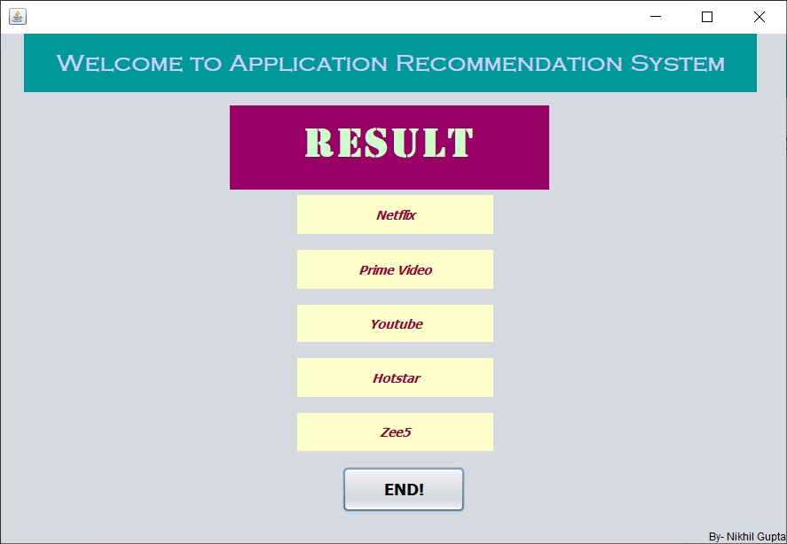

# Application Recommendation_System
Recommendation System is a subcategory of information filtering systems that seek to forecast the rating or preference that consumer would give it to a piece of information.
 
I have tried to build my own recommendation system based on 2 well-known approaches.
 
This is the Window Executable Application which tries to recommend Mobile Applications based on user past experience of other apps and popular apps irrespective of user's preference.
 
Java supports a bunch of GUI features. I have used NetBeans IDE to develop different pages in the Recommendation System Application. For database management, I have used MySQL. JDBC is used to connect MySQL database to the java program.
 
I will be implementing 2 Approaches which are-
1. Collaborative Filtering Approach based on Memory-Based Techniques using Cosine Similarity to find the closest neighbour. (User-based CF)
2. Popularity Approach using average rating.
### The algorithm of Collaborative Filtering Approach used is-
1. The database is created for n items and m users in the form of matrix.
2. When we have a targeted user A then using the help of ratings provided by A in the
past, then we try to find the cosine similarity with those of m users.
3. We try to find out the user B which has the highest similarity.
4. We find the items P which was liked by B in the past.
5. We recommend P items which are likely to be liked by user A.
### The algorithm used in Popularity approach used is-
1. The ratings/reviews are collected as the feedback of the item.
2. The Average ratings are calculated.
3. Items are sorted according to the user.
4. Items are recommended with highest average ratings
#### Different Pages of our application are-
**1. First Page**  
 
This is our first page of the application. The function of the button are as follows: -
* Start Button- Using this button, we will see the implementation of the Collaborative Filtering Approach based on Memory-Based Techniques using Cosine Similarity to find the closest neighbour. (User-Based CF)
* Popular Button- Using this button, we will see the implementation of Popularity Approach. 

**2. Collaborative Filtering Approach**  
 
If we click on start and complete the form by filling the information the page will be shown like this. This page tries to understand the taste and preference of the user which helps to recommend applications on that basis. In this page we have to select the category we want to in which we are interested to have a recommendation. Then to have information about taste and preference we ask the user to select the category from which he has already used the apps and ask him to rate the given apps on the basis of his likeness. In this way, we try to know about the user. 
**3.Popularity Approach** 
 
On clicking the Popular button on the first page, we will see this page which will ask only for the desired category in which we are desired. Then according to Popularity Approach, we will display the result of the apps which are highly on the next page. 
**4. Result** 
 
On submitting the previous forms, we will see the prediction on the basis of Collaborative Filtering Approach or Popularity in the form of the result.In case of Collaborative Filtering Approach, the topmost prediction is most likely to be liked by the user and bottommost prediction is least likely to be liked by the user. The result of popular Application is that  the topmost application is top rated and bottommost app is least rated in their respective categories. 
